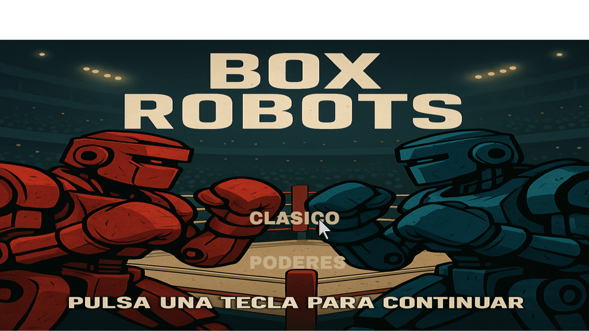
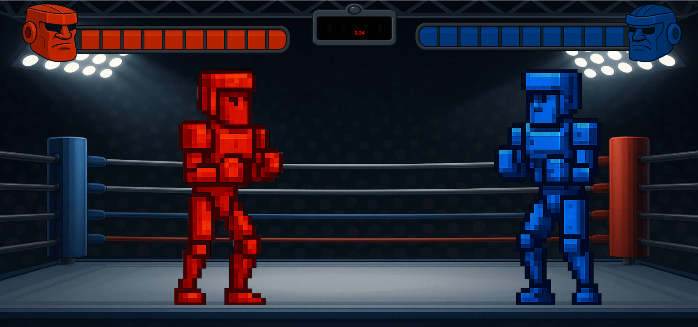
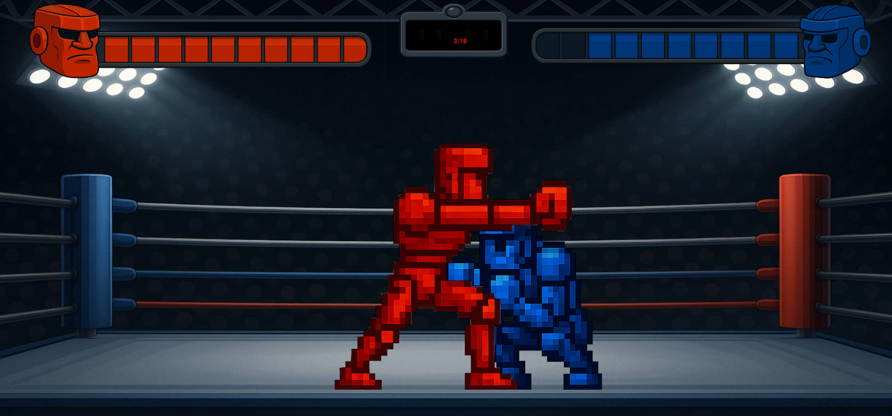
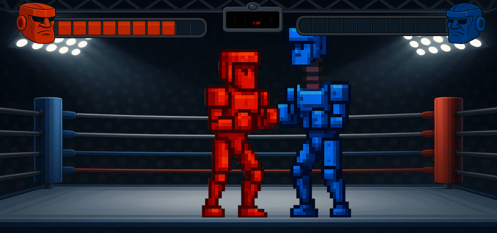

# ⚔️ Box Robots ⚔️
🥊🤖 ¡Prepárate para el combate definitivo!
En un futuro donde las guerras ya no se libran con ejércitos, el verdadero honor se conquista en el ring de acero.

Dos robots boxeadores, forjados para la lucha, se enfrentan cara a cara en un duelo brutal de puños, estrategia y potencia mecánica.

En esta arena no hay armas, solo golpes de titanio, reflejos al límite y habilidades especiales que pueden cambiarlo todo en un segundo.

¿De qué lado estás?

## Equipo de desarrollo

- Franco Gabriel Rojas
- Ian Nahuel Rueda 
- Imanol Janse 
- Fabricio Ianni Lucio

## Capturas

## ⚔️Reglas de combate⚔️
Antes de que las chispas vuelen y el acero retumbe, cada jugador elige su guerrero mecánico:
¿Será el veloz y preciso Robot Azul, o el imparable y brutal Robot Rojo?
Pero eso no es todo… también deberás seleccionar una habilidad especial, única y definitiva, que podrá cambiar el curso del combate en el momento justo.

El enfrentamiento se decide por rondas.
El primero en lograr 2 victorias seguidas demostrará su dominio absoluto.
Pero si la batalla se alarga, el primero en conquistar 3 rondas totales se coronará como el campeón supremo.

🔥 Lucha con inteligencia. Golpea con fuerza. Y sobre todo... no pierdas ni una chispa de concentración.
El destino de tu robot está en tus manos.

## Controles

## Otros

- Programacion de Objetos 1 - UNAHUR
- Versión de wollok
- Una vez terminado, no tenemos problemas en que el repositorio sea público
